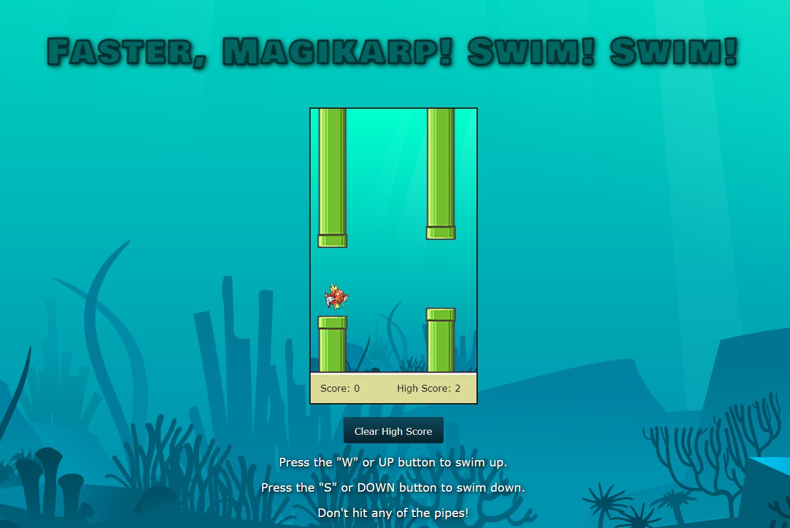

# Faster, Magikarp! Swim, swim!

I created a Flappy Bird-based game called "Faster, Magikarp! Swim! Swim!" It has some of the functionality 
as the original Flappy Bird but with a few differences. I created this with vanilla JavaScript,
no libraries. All sprites, sound effects, and background images are from online public databases,
and they're royalty-free and do not require credit.

## Preview:

## How to Play:
* Press the "W" or UP button to swim up.
* Press the "S" or DOWN button to swim down.
* Don't hit any of the pipes!

## Want to play? Follow these instructions:
1. Download this repository's zip file (Click the green code button. There, you will find the "Download Zip" option).
2. Once downloaded into your local, unzip the folder.
3. Inside the folder, you should see an **index.html** file. Click on that and it should open up in your browser.
4. Enjoy! :)
